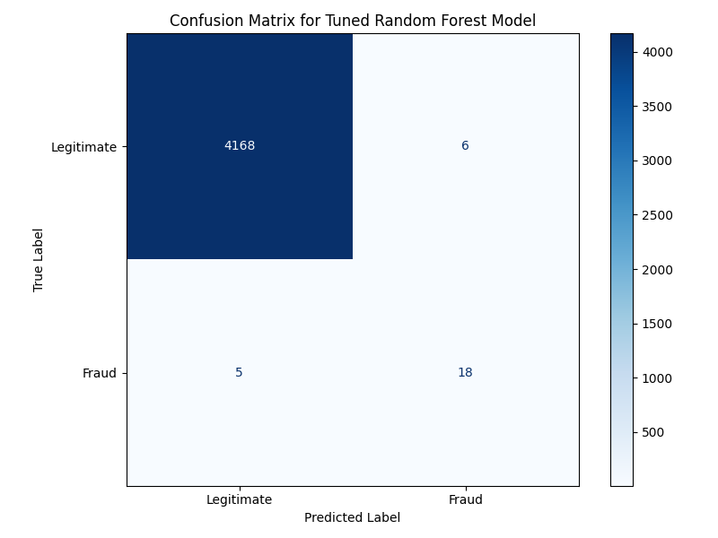

# Online Payment Fraud Detection Project

---

### **Project Overview & Problem Statement**

Online transactions are the backbone of the modern economy, but they come with the constant threat of **fraud**. This project aims to build a **machine learning model** capable of identifying fraudulent online payment transactions hidden within a large-scale financial dataset.

A key challenge was the **extreme class imbalance** in the data: legitimate transactions vastly outnumbered fraudulent ones by thousands to one. Our goal was to create a model that could effectively detect fraud (achieving High Recall) while keeping false alarms low (maintaining decent Precision).

---

### **Data Understanding & Preprocessing**

Initially, the dataset contained 20,983 transactions. Our early analysis revealed:

* **Missing Values:** Only a single row had missing values, which was easily handled by removal.
* **Irrelevant Features:** Columns like `nameOrig` and `nameDest` were removed due to their high cardinality (too many unique values), making them unsuitable for direct use by the model.
* **Class Imbalance:** This was the most critical issue. The dataset showed:
    * **20,901 Legitimate Transactions** (Class 0)
    * **Only 81 Fraudulent Transactions** (Class 1)
    This severe imbalance posed a significant challenge for model training.

**Preprocessing Steps Implemented:**

1.  **Categorical Encoding:** The `type` column (e.g., 'CASH_OUT', 'TRANSFER', 'PAYMENT') was converted into a numerical format using **One-Hot Encoding**.
2.  **Data Splitting:** The dataset was split into training and testing sets (80% for training, 20% for testing).
3.  **Handling Imbalance with SMOTE:** To address the class imbalance, **SMOTE (Synthetic Minority Over-sampling Technique)** was applied to the training data. This created synthetic samples for the minority (fraud) class, balancing the class distribution in the training set (resulting in 16,727 samples for each class). This step was crucial for enabling the model to learn fraud patterns effectively.

---

### **Model Selection & Hyperparameter Tuning**

We evaluated two popular classification models: **Logistic Regression** and **Random Forest Classifier**.

* **Initial Performance Comparison (on Test Set):**
    * **Random Forest Classifier:**
        * **Precision (Fraud): 0.75**
        * **Recall (Fraud): 0.78**
        * **F1-Score (Fraud): 0.77**
        * **AUC Score: 0.9988**
    * **Logistic Regression:**
        * **Precision (Fraud): 0.06**
        * **Recall (Fraud): 0.91**
        * **F1-Score (Fraud): 0.12**
        * **AUC Score: 0.9350**

**Decision:** The **Random Forest Classifier** significantly outperformed Logistic Regression, particularly in terms of **Precision and F1-score** for the fraud class. Thus, Random Forest was selected for further optimization.

**Hyperparameter Tuning with RandomizedSearchCV:**
To enhance the Random Forest model's performance, **RandomizedSearchCV** was employed. This efficiently searched for the optimal combination of model parameters (e.g., `n_estimators`, `max_depth`).

* **Best Parameters Found:** `{'bootstrap': False, 'max_depth': 16, 'max_features': 'log2', 'min_samples_leaf': 1, 'min_samples_split': 9, 'n_estimators': 134}`
* **Best Cross-Validation F1-score:** 0.9992 (achieved on the training data during tuning)

---

### **Final Model Performance & Evaluation**

The tuned Random Forest model's performance was rigorously evaluated on the unseen test set:

* **Classification Report (Test Set):**
    ```
                  precision    recall  f1-score   support

             0.0       1.00      1.00      1.00      4174  (Legitimate)
             1.0       0.75      0.78      0.77        23  (Fraud)

        accuracy                           1.00      4197
       macro avg       0.87      0.89      0.88      4197
    weighted avg       1.00      1.00      1.00      4197
    ```
* **AUC Score:** `0.99875`

**Key Interpretations:**
* **Exceptional Legitimate Detection:** The model accurately identified 4168 out of 4174 legitimate transactions (1.00 Precision & Recall for class 0.0), demonstrating high reliability for non-fraudulent cases.
* **Strong Fraud Detection:** Out of 23 actual fraudulent transactions, the model successfully **detected 18 (Recall of 0.78)**. Furthermore, **75% of the transactions it flagged as fraud were indeed fraudulent (Precision of 0.75)**.
* **High AUC:** An AUC score of `0.99875` indicates the model's excellent overall ability to distinguish between fraud and legitimate transactions.

---

### **Key Insights from Feature Importance**

The model provided valuable insights into which features were most critical for fraud detection:

* **`step` (Transaction Hour): The Most Important Feature (Importance: 0.221)**
    * Initially, `step` 8 appeared to be the most frequent transaction hour.
    * However, a deeper analysis of **fraud percentage per `step`** revealed a crucial pattern:
        * **Highest Fraud Percentage:** `step` **4 (1.77%)**, `step` **6 (1.33%)**, and `step` **5 (0.90%)** showed significantly higher fraud ratios, despite having fewer total transactions.
        * **Lowest Fraud Percentage:** `step` **8 (0.04%)** had the highest transaction volume but a very low fraud rate.
    * **Insight:** The model learned to use `step` as a critical indicator. It understood that transactions occurring at `step` 8 are highly likely to be legitimate, while those at `step` 4, 5, or 6 have a proportionally much higher chance of being fraudulent.


---

### **Error Analysis: Understanding Misses and False Alarms**

Understanding the model's mistakes is vital in fraud detection:

* **False Negatives (Missed Fraud): 5 Transactions**
    * These were 5 actual fraudulent transactions that the model failed to detect.
    * Sample analysis showed these were often `CASH_OUT` or `TRANSFER` types, and 3 involved the source account being drained (`oldbalanceOrg > 0` and `newbalanceOrig == 0`). Their `step` values were within common ranges (1, 6, 7).
    * **Implication:** There are subtle characteristics in these missed cases that the model hasn't fully captured. Further in-depth analysis and potential feature engineering (e.g., specific balance ratios, velocity features) could target these.

* **False Positives (Incorrectly Flagged as Fraud): 6 Transactions**
    * These were 6 legitimate transactions that the model mistakenly flagged as fraudulent.
    * Sample analysis indicated these were also `CASH_OUT` types with significant balance changes, which might have led the model to suspect them as fraud.
    * **Implication:** These cases share similarities with fraudulent transactions. While not ideal for user experience, they can be managed with secondary review processes without rejecting legitimate users outright.



---

### **Conclusion & Future Work**

We successfully built a robust Online Payment Fraud Detection Model that effectively handles **extreme class imbalance** and detects fraudulent transactions with high accuracy and recall. The model provides valuable insights, particularly from the transaction hour (`step`).

**Potential Future Work:**

* **Deeper False Negative Analysis:** Investigate the 5 missed fraud cases further to engineer new features (e.g., specific balance ratios, velocity features) that could help detect them.
* **Threshold Optimization:** Adjust the model's prediction probability threshold to achieve a better balance between Recall and Precision, aligning with specific business requirements.
* **Real-time Implementation:** Explore strategies for deploying and applying the model on a live transaction stream.

---

### **How to View This Project**

You can explore this project in detail:

* **[Open Project in Google Colab (View Live Notebook)](https://colab.research.google.com/drive/1iRli6cCtNkoRdlN29Icdfo-3AQtbfzfi?usp=sharing)**   
* The full Jupyter Notebook (`.ipynb` file) containing all the code and detailed analysis is also available in this repository.
* The trained model (`tuned_random_forest_model.joblib`) and the data preprocessor (`data_preprocessor.joblib`) are saved in the `fraud_detection_model/` directory within this repository.

---
